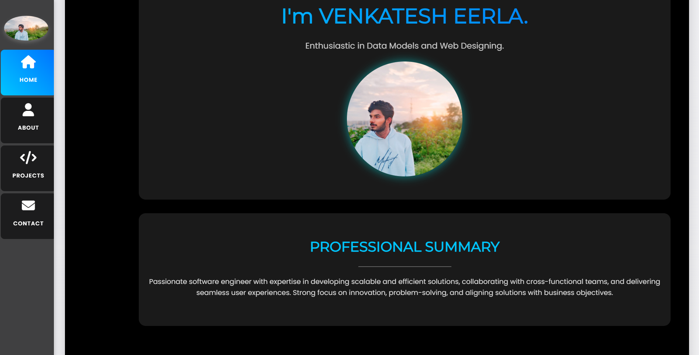
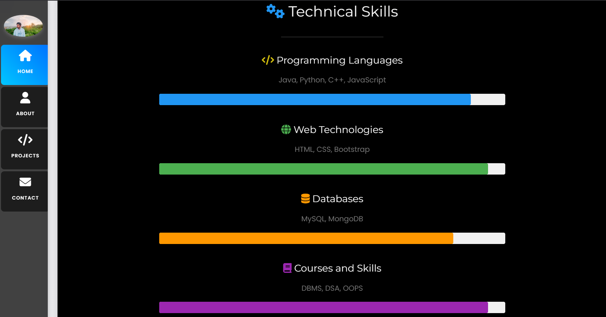

# 🎨 UI and UX Portfolio

Welcome to my personal **UI and UX Portfolio**, crafted to showcase my skills, design philosophy, and visual creativity. The portfolio is designed using HTML, CSS, and JavaScript to present a professional layout of my achievements, skills, and journey.

---

## 📌 Sections Overview

- **Home** – Introduction and tagline
- **About** – Professional summary and technical strengths
- **Projects** – A section to showcase work (customizable)
- **Contact** – Social links and resume access

---

## 🖼️ Portfolio Preview

### Home & Summary

### Technical Skills

### Developer Tools & Resume Section

## 👨‍💻 About Me

**I'm VENKATESH EERLA**  
Enthusiastic about Data Models and Web Designing.  
Passionate software engineer with expertise in developing scalable and efficient solutions, collaborating with cross-functional teams, and delivering seamless user experiences.

---

## 🔗 Socials & Resume

- [LinkedIn](https://www.linkedin.com/in/eerla-venkatesh/)
- [GitHub](https://github.com/EERLA-VENKATESH)
- [LeetCode](#)
- [CodeChef](#)
- [HackerRank](#)
- [GeeksforGeeks](#)

📄 [Download Resume](#)
